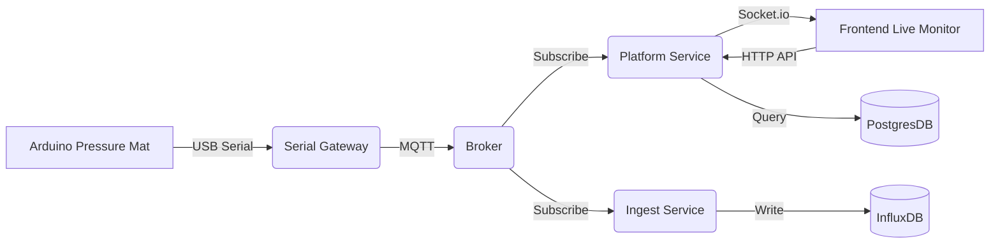

# 📖 Omni Project - คู่มือระบบ Backend ฉบับสมบูรณ์ (Complete Guide)

เอกสารนี้รวบรวมรายละเอียดเชิงลึกของระบบ Backend ทั้งหมด เพื่อให้ทีมงานเข้าใจการทำงานทุกขั้นตอน ตั้งแต่ Hardware ไปจนถึงการแสดงผลครับ

---

## 🏗️ 1. สถาปัตยกรรมระบบ (System Architecture)

ระบบเราทำงานแบบ **Event-Driven & Real-time** เชื่อมต่อกันดังนี้:

### การไหลของข้อมูล (How it works step-by-step):

1.  **กดแผ่นยาง:** Arduino อ่านค่าแรงกด (0-1023) จาก Sensor 256 จุด (16x16).
2.  **ส่งข้อมูล (Serial):** Arduino ส่งข้อมูลผ่านสาย USB เป็นข้อความ `TABLE ...ข้อมูล... END`.
3.  **แปลงข้อมูล (Gateway):** โปรแกรม `gateway.js` อ่าน Serial Port, แปลงข้อความเป็น JSON Array.
4.  **กระจายข่าว (MQTT):** Gateway ส่ง JSON ไปที่ MQTT Topic `iot/matrix/stream`.
5.  **แยกทางเดินข้อมูล (Fork):**
    - **ทางที่ 1 (Live View):** `Platform Service` รับ MQTT แล้วส่งต่อทันทีผ่าน Socket.io ไปหา Frontend (เร็วมาก < 50ms).
    - **ทางที่ 2 (History):** `Ingest Service` รับ MQTT แล้วบันทึกลง InfluxDB เก็บไว้ดูย้อนหลัง.
6.  **แสดงผล:** Frontend ได้รับข้อมูลจาก Socket.io ก็นำไปวาดสี Heatmap (แดง/น้ำเงิน).

---

## 📂 2. เจาะลึกไฟล์และหน้าที่ (File Descriptions)

### 🅰️ Platform Service (`omni-back-end/platform-service`)

หัวใจหลักของระบบ รันที่ Port `4000`.

- **`index.js`**:
  - จุดเริ่มต้นของ Server.
  - เปิด **Socket.io Server** เพื่อรอ Frontend มาเชื่อมต่อ.
  - เชื่อมต่อ **MQTT Broker** เพื่อดักฟังข้อมูลจากอุปกรณ์.
  - เมื่อได้ข้อมูล -> สั่ง `io.emit('matrix-data', data)` ส่งไป Frontend ทันที.
- **`prisma/schema.prisma`**:
  - โครงสร้าง Database (Postgres).
  - เพิ่มตาราง `Device` (เก็บชื่อและ Serial Number).
  - เพิ่มตาราง `DeviceProfile` (เก็บสเปคอุปกรณ์).
- **`controllers/deviceController.js`**:
  - จัดการเพิ่ม/ลบ/แก้ไขข้อมูลอุปกรณ์ใน Postgres.
  - สำคัญ: เช็ค `serial_number` ห้ามซ้ำกัน พราะใช้เป็น Hardware ID.
- **`controllers/telemetryController.js`**:
  - เชื่อมต่อ InfluxDB.
  - ดึงข้อมูลย้อนหลัง (`queryApi`) แล้วแปลงเป็น JSON ให้ Frontend วาดกราฟเส้น.

### 🅱️ Serial Gateway (`omni-back-end/serial-gateway`)

โปรแกรมเชื่อมต่อฮาร์ดแวร์ (รันบนเครื่องที่เสียบ Arduino).

- **`gateway.js`**:
  - ใช้ library `serialport` อ่านข้อมูลจาก USB Port (`COM4`).
  - มี Logic ตัดคำ (Parser): เพราะข้อมูลจาก Arduino อาจมาไม่ครบทีเดียว มันจะรอจนกว่าจะเจอคำว่า `END` ถึงจะถือว่าครบ 1 เฟรมภาพ.
  - มีระบบ Auto-Reconnect: ถ้าสายหลุด โปรแกรมจะไม่พัง แต่จะรอเสียบใหม่.

### 🆎 Ingest Service (`omni-back-end/ingest-service`)

หน่วยจดบันทึก (Low-Latency Write).

- **`ingestLogic.js`**:
  - รับข้อมูลจาก MQTT.
  - เช็คก่อนว่า "อุปกรณ์นี้มีในระบบจริงไหม?" (ป้องกันข้อมูลขยะ).
  - เขียนลง InfluxDB โดยใช้ `writeApi` (เขียนแบบ Batch เพื่อประสิทธิภาพสูงสุด).

---

## 🔌 3. API Documentation (REST API)

Frontend เรียกใช้งานผ่าน URL `http://localhost:4000/api/admin/...` โดยต้องแนบ `Authorization: Bearer <token>` ทุกครั้ง.

### 👤 User Management

| Method | Endpoint       | Description                        |
| :----- | :------------- | :--------------------------------- |
| `GET`  | `/get-users`   | ดูรายชื่อ User ทั้งหมด             |
| `POST` | `/create-user` | สร้าง Admin/User ใหม่ (admin only) |

### 🛠️ Device Management

| Method   | Endpoint             | Description                    | params                              |
| :------- | :------------------- | :----------------------------- | :---------------------------------- |
| `GET`    | `/get-devices`       | ดูรายการอุปกรณ์ทั้งหมด + สถานะ | -                                   |
| `POST`   | `/create-device`     | เพิ่มอุปกรณ์ใหม่               | `name`, `serialNumber`, `profileId` |
| `DELETE` | `/delete-device/:id` | ลบอุปกรณ์                      | `id`                                |

### 📈 Telemetry (History)

| Method | Endpoint             | Description           | params                   |
| :----- | :------------------- | :-------------------- | :----------------------- |
| `GET`  | `/get-telemetry/:id` | ดึงข้อมูลกราฟย้อนหลัง | `id` (ใช้ Serial Number) |

### 📝 Device Profile

| Method | Endpoint          | Description                                  |
| :----- | :---------------- | :------------------------------------------- |
| `GET`  | `/get-profiles`   | ดูรายการ Profile (เช่น Mat 16x16, Sensor v1) |
| `POST` | `/create-profile` | สร้าง Profile ใหม่ (กำหนด spec ข้อมูล)       |

---

---

## 🔌 4. รายละเอียด Port การใช้งาน (Network & Ports)

ระบบนี้ฟิกซ์ Port การใช้งานไว้ดังนี้ หากต้องการแก้ไขต้องแก้ในไฟล์ `.env` หรือ `index.js` ของแต่ละ Service

| Port     | Service          | Protocol             | การใช้งานจริง                                                                                 |
| :------- | :--------------- | :------------------- | :-------------------------------------------------------------------------------------------- |
| **4000** | Platform Service | `HTTP` & `WebSocket` | **Main API:** ใช้ยิง Request จากหน้าเว็บ **Live Stream:** ใช้ส่งภาพ Heatmap ผ่าน Socket.io |
| **5173** | Frontend (Vite)  | `HTTP`               | **Web Server:** สำหรับรันหน้าเว็บ React ระหว่างพัฒนา (Dev Mode)                               |
| **1883** | Mosquitto        | `MQTT`               | **Message Broker:** ทางด่วนข้อมูลระหว่าง Arduino -> Server (ห้ามเปลี่ยน)                      |
| **5432** | Postgres         | `TCP`                | **Database:** เก็บข้อมูล User, Device, Profile                                                |
| **8086** | InfluxDB         | `HTTP`               | **Time-Series DB:** เก็บกราฟข้อมูล Sensor ย้อนหลัง                                            |
| **COM4** | Serial Port      | `UART`               | **USB Serial:** พอร์ตที่ใช้เชื่อมต่อกับ Arduino (บน Windows)                                  |

> **Note:** ตรวจสอบให้แน่ใจว่าไม่มีโปรแกรมอื่นแย่งใช้ Port 4000 หรือ 1883 ไม่งั้นระบบจะ Start ไม่ขึ้น

---

## 🚀 5. วิธีเริ่มใช้งาน (Cheat Sheet)

### ลำดับการรันที่ถูกต้อง:

1.  **Start Database:** `docker-compose up -d` (Postgres, InfluxDB, MQTT).
2.  **Start Platform Service:** `npm run dev` (Port 4000).
3.  **Start Ingest Service:** `node index.js`.
4.  **Connect Arduino:** เสียบสายที่ COM4.
5.  **Start Gateway:** `node gateway.js`.
6.  **Start Frontend:** `npm run dev` (Port 5173).

เมื่อรันครบทุกตัว:

- เปิดหน้าเว็บ -> ไปที่เมนู **Device Inventory** -> สร้างอุปกรณ์ใหม่ ใส่ ID `MAT_001` (หรือตามโค้ด Arduino).
- ไปที่เมนู **Live Monitor** -> จะเห็นภาพ Heatmap ขึ้นมาทันที!

---

---

## 🔍 5. รายละเอียดเชิงลึก: การทำงานของแต่ละไฟล์ (Deep Dive)

### 📂 Backend Files (`omni-back-end/platform-service`)

#### `controllers/deviceController.js`

ทำหน้าที่จัดการข้อมูลอุปกรณ์ในฐานข้อมูล Postgres

- **`createDevice`**:
  - รับค่า: `name`, `serialNumber`, `profileId`
  - Logic: ตรวจสอบว่า `serialNumber` นี้มีอยู่ในระบบหรือยัง ถ้ายังให้สร้างใหม่ ถ้ามีแล้วให้แจ้ง Error
  - ความสำคัญ: `serialNumber` คือกุญแจสำคัญที่ใช้ผูกกับ Hardware จริง
- **`getAllDevices`**:
  - ดึงข้อมูลอุปกรณ์ทั้งหมด พร้อมกับเช็คสถานะ Online/Offline (mock logic หรือเช็คจาก last_seen ในอนาคต)

#### `controllers/telemetryController.js`

ท่อเชื่อมต่อไปยัง InfluxDB เพื่อดึงข้อมูล Sensor

- **`getDeviceTelemetry`**:
  - รับค่า: `deviceId` (ซึ่งเราใช้ Serial Number แทน ID)
  - Logic: ใช้ InfluxQL Query ข้อมูลล่าสุด 50-100 จุด เพื่อส่งให้ Frontend วาดกราฟย้อนหลัง
  - การแปลงข้อมูล: ข้อมูลจาก Influx จะมาในรูปแบบ Array ของ Object เราต้องแปลงให้เป็น JSON ที่ Frontend เข้าใจง่ายๆ

#### `controllers/deviceProfileController.js`

จัดการ "สเปค" ของอุปกรณ์ (Template)

- **หน้าที่**: บอกระบบว่าอุปกรณ์นี้คือ "Matrix 16x16" หรือ "Temperature Sensor"
- **สำคัญยังไง**: Ingest Service จะใช้ Profile นี้ในการตัดสินใจว่าจะบันทึกข้อมูลท่าไหน (เช่น บันทึกเป็น JSON Blob หรือ Int)

---

## 🔐 6. Authentication Flows

ระบบใช้ JWT (JSON Web Token) ในการยืนยันตัวตน

1.  **Login**: User ส่ง username/password -> Server คืนค่า `token`
2.  **Access API**: Frontend ต้องแนบ `Authorization: Bearer <token>` ในทุก Request Header
3.  **Middleware (`authMiddleware.js`)**: จะดักจับทุก Request เพื่อเช็คว่า Token ถูกต้องไหม และเป็น Role อะไร (Admin/User)

---

## 🔄 7. Data Flow Scenario: "เมื่อมีคนเหยียบแผ่นยาง"

1.  **Hardware**: Arduino อ่านค่าแรงกด -> ส่ง Serial `TABLE ... 1023 ... END`
2.  **Gateway**: `gateway.js` (Laptop เชื่อม USB) อ่านเจอคำว่า `TABLE` -> เก็บข้อมูลจนเจอ `END` -> แปลงเป็น JSON `[[0,0...],[...]]` -> ส่ง MQTT `iot/matrix/stream`
3.  **Backend (Real-time)**: `index.js` รับ MQTT -> ยิง Socket.io `emit('matrix-data')` -> หน้าเว็บ `liveMonitor.jsx` รับไปแสดงผล (สีแดง) ทันที
4.  **Backend (Storage)**: `ingestLogic.js` รับ MQTT -> ดูว่า Serial `MAT_001` คือใคร -> บันทึกลง InfluxDB

---

จัดทำโดย: **Omni Team** 🚀
